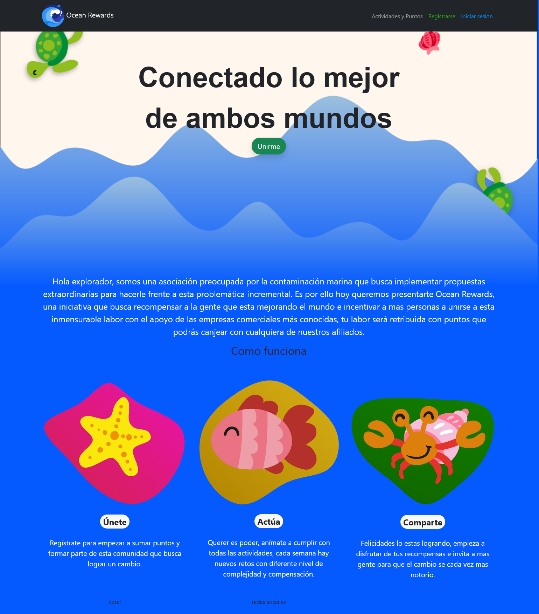
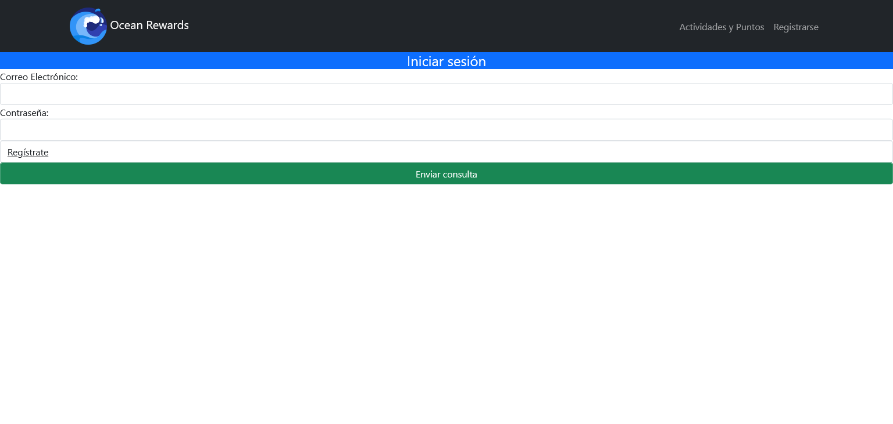
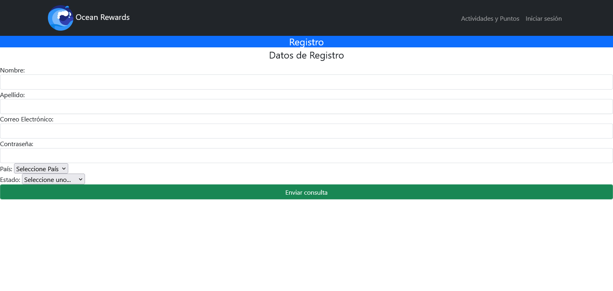
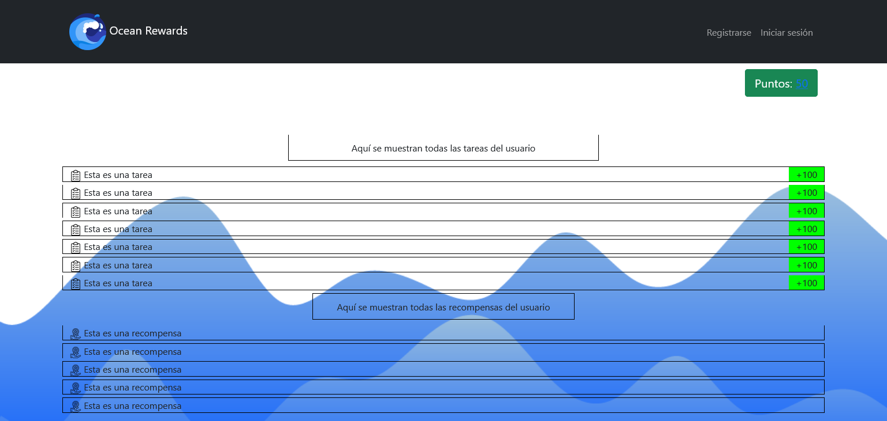

# SavingOurOceans-Backend 🐳


## Herramientas 🐋

| Herramientas | Version |
| ------------ | ------- |
| Node         | >=6.9.0 |
| Jest         | 28.1.0  |
| Express      | 4.18.1  |
| Git          |         |
| Eslint       | 8.15.0  |

## Diseño de Solución

| Vista | Propósito | Interacción |
| ----- | --------- | ----------- |
|  | Informar al usuario de nuestra misión y hacer conciencia de lo que pasa actualmente con nuestros mantos acuíferos.               | El usuario se podrá desplazar por la página principal. Podrá interactuar con el menú de navegación, asi como con el botón de "Unirme". |
|  | Iniciar sesión para que el usuario pueda disfrutar de sus beneficios que ha ido generando con un cambio tangible hacia el medio ambiente. | Llenar campos: Correo, contraseña. Presionar el botón "Enviar consulta". O dar a la opción de registrarse. |
|  | Incentivar al usuario a que se cree una cuenta y pueda formar parte del cambio para mejorar nuestro medio ambiente.              |Llenar campos: Nombre, apellido, correo, contraseña. Seleccionar pais y estado. Presionar el botón "Enviar consulta".|
|  | Hacerle ver las tareas y recompensas que existen.                                                                             | El usuario podrá realizar determinada tarea para la obtención de puntos. También será capaz de utilizar sus puntos para conseguir recompensas, dependiendo del número de puntos que posea. |


### Controladores y Servicios 🐳


### Pruebas 🐳

__Se realizaron pruebas unitarias para cada método que traerá la API.__

```js
const ConsumeServicioApiTaskS= require('./../../lib/services/ConsumeServicioApiTaskS')
const Reader= require('./../../lib/utils/Reader')
const task = Reader.readJsonFile("taskDummyVistas.json"); 

test("1.Consumir servicio post Info de Api task", ()=>{
    const taskId = task.id;
    const respuestagetInfo = ConsumeServicioApiTaskS.getInfo(taskId);
    expect(respuestagetInfo).toBeDefined();
})

test("2.Consumir servicio post Info de Api createTask", ()=>{ 
    const respuestaCreateTask = ConsumeServicioApiTaskS.createTask(task);
    expect(task).toBeDefined();
})

test("3.Consumir servicio post Info de Api updateItsAvailable", ()=>{ 
    const respuestagUpdateItsAvailable = ConsumeServicioApiTaskS.updateItsAvailable(task.id, task.isAvailable);
    expect(respuestagUpdateItsAvailable).toBeDefined();
})

test("4.Consumir servicio post Info de Api updateItsDone", ()=>{ 
    const respuestagUpdateItsDone = ConsumeServicioApiTaskS.updateItsDone(task.id, task.isDone);
    expect(respuestagUpdateItsDone).toBeDefined();
})

test("5.Consumir servicio post Info de Api getPoints", ()=>{ 
    const respuestaGetPoints = ConsumeServicioApiTaskS.getPoints(task.id);
    expect(respuestaGetPoints).toBeDefined();
})

test("6.Consumir servicio post Info de Api updatePoints", ()=>{ 
    const respuestaUpdatePoints = ConsumeServicioApiTaskS.updatePoints(task.id, task.points);
    expect(respuestaUpdatePoints).toBeDefined();
})


```

__Pruebas unitarias para la clase que contiene los métodos que se usarán para el llamado a API(GET Y POST)__

```js
const ApiLlamado= require('./../../lib/services/ApiLlamado')

describe("Test llamado a apis ApiLlamado, que la peticón no se envie vacía", ()=>{
    test("1.Probando metodo de llamado tipo post", ()=>{   
        const apiPost=ApiLlamado.apiPost();
        expect(apiPost).toBeDefined();
    })  
    test("2.Probando metodo de llamado tipo get, response no venga nulo", ()=>{   
        const apiGet=ApiLlamado.apiGet();
        expect(apiGet).toBeDefined();
    }) 
})
```

__Pruebas unitarias para la clase que se usa para leer los json con datos dummy que se usaron para simular datos que llegarían desde API__

```js
const Reader= require('./../../lib/utils/Reader')

    test("1.Leer archivo rewads Json que no existe", ()=>{
     const rewards = Reader.readJsonFile("rewadsDummyVistas.json"); 
     expect(rewards).toBe(rewards)
     })
  


    test("2.Leer archivo task Json que no existe", ()=>{
        const task = Reader.readJsonFile("taskDummyVistas.json"); 
        expect(task).toBe(task)
        })

           
     test("3.Leer archivo user Json que no existe", ()=>{
        const user = Reader.readJsonFile("userDummyVistas.json"); 
        expect(user).toBe(user)
        })


   
```


__Evolución Previsible:__ 

Terminar la creción de pruebas unitarias para todos los métodos de todas las APIS, para el controller que manejará la información.

Se deja construida la estructura:


### Automatización de Pruebas 🐳

No se incluyo automatización de pruebas, ya que se priorizaron todos los esfuerzos en las prebas unitarias para consumir los métodos de la API Task.

__Evolución Previsible:__ 

Atomatización de actions github para revisión de pruebas cada que se de push.

